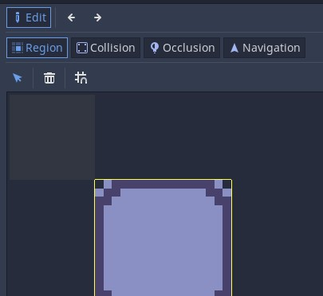
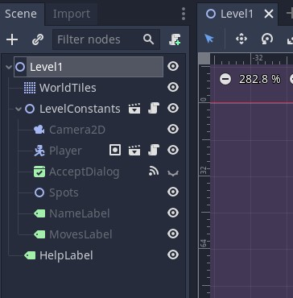
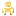
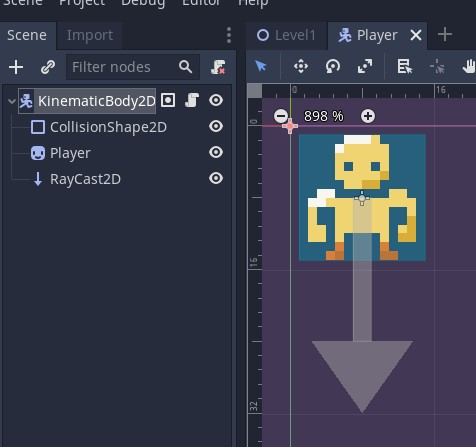
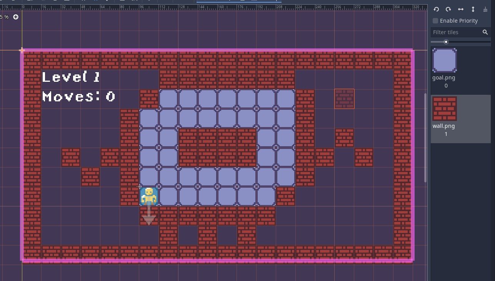

# My tileMap Game [(Only 1% can get to Level 10!!)](https://legoguy32109.itch.io/only-1-can-make-it-to-level-10) Documentation

Final Project for 2D game development from Andy Harris *(Inspired by mobile game ads)*
* * *


## User Instructions

To play my game, just click the **[bold link here](https://legoguy32109.itch.io/only-1-can-make-it-to-level-10)** or up in the title to reach the itch.io page. You can run it in your browser and you move the player with **WASD** or the arrow keys ➡⬅⬆⬇. To restart the level if you get stuck, or want to try for lower moves, use **R**.Unfortunately it is not mobile friendly, you will need a computer with a keyboard and an internet connection.

The game is made in [Godot](https://godotengine.org/), an amazing game engine that makes game design fun. Using nodes I was quickly able to prototype game mechanics, then hone them through GDscript. I was drawn to use Godot beacuse of their interesting tileMap editor. I was getting exhausted manually inputting coordinates to design levels. With some interesting advice from [PlayWithFurcifer](https://www.youtube.com/watch?v=5mGa2m_qCPQ) I discovered how to use scenes for tileMaps!

### TileMap innovation [found in this video](https://www.youtube.com/watch?v=5mGa2m_qCPQ)

What that last part meant, was initially the biggest limitation for tile maps is that you can draw reigons for Collisons, light Occlusions, or a connected Nav mesh for path finding. These features are fine for the walls that only need collision areas, but I needed player interacts to happen when I walked over these tiles...


This behavior can be encapsultaed in a scene, which is the Godot answer to Unity prefabs. A simple area that modulates itself to be greener when the player walks over it. It also store the state that it's activated so it won't be activated again, as without that the sound effect would constantly play as the character moved over them.

The soultion, render a dummy tile in the tileMap that are individually replaced by the scene as the level loads. [Here](Game.gd#L22) I go through each cell in the tileMap, identify if it's the dummy and should be replaced, then make an instance of the proper tile from the scene and add it to the same position of the current dummy.

```GDscript
# in Game.gd ...

for cellpos in tilemap.get_used_cells():
    var cell = tilemap.get_cellv(cellpos)
    # if the cell is labeled 0, it's the spot tiles and we want to replace 
    if cell == 0:
        # generate an instance of the tile place it at tileMap position
        var tile = spot.instance()
        tile.position = tilemap.map_to_world(cellpos) * tilemap.scale
        $Spots.add_child(tile)
        tilemap.set_cellv(cellpos, -1) # hide placeholder tile
```

I had to be careful to not do this before all the nodes were loaded, or I could be referencing a tilemap that doesn't exist. I discuss the design I implemented to fix this later in the documenation.

## Game Design Document

### Components of a Level

Each level is titled `Level<level_number>.tscn` in a the `./Levels` directory. When the game end state is activated, a dialog pops up explaining the level is over, and once accepted loads the next level based on the formula. `Level(<cur_level_number>+1).tscn`, if that level file can't be found, load Level1 to loop the game.



- Scene root (Level1)
  - TileMap (WorldTiles)
  - Group of reused nodes (LevelConstants)
    - Camera to render scene to display (Camera2D)
    - Player scene incorperating movement and user input (Player)
    - Popup when level ends to confirm next level (AcceptDialog)
    - Group of tiles to activate to complete level (Spots)
    - Level name, follows formula `"Level "+str(<cur_level_number>)` (NameLabel)
    - Text displaying moves taken in level `"Moves: "+moves` (MovesLabel)
  - Optional label displaying help text (HelpLabel) *can have more than one*

Early in development, I had the game manager script attached to the scene root, so it could access all the nodes under it. I later found I was copying a lot of nodes with no changes, so I decided to put these 'level constants' into a scene and easily reuse them for each level. I then found that attaching the game manager script to this scene made a lot more sense then having to navigate down a node to grab data from all the nodes, so I simply rewrote any reference to the tileMap to be the first child of the parent. `onready var tilemap = get_parent().get_child(0)` The final headache was when the script would run too early before all the nodes had been loaded into the scene, and I would get errors trying to replace tiles that didn't exist yet. To fix that I simply added checks that the scene was loaded, `ready == true` and double check the objects I was referencing existed `if tilemap:`. I highly recommend seperating objects you use with no changes into a scene that you can reference later, it made generating levels a lot easier. Also, when you set the LevelConstants scene to have editable children, I could then specify the location of the player and labels when I needed to change their postions depending on the level design, very convenient. 👍

### Game.gd components

The game manager script does multiple things:

1. Identify next level to load after end state
2. Set labels appropriately at the beginning and during gameplay
3. Aquire the tilemap node, and replace placeholder tiles with instances of a functioning 'Spot' scene.
4. Identify end state is reached when all Spot scenes are active.
5. Change the level when the accept dialog transmits confirmation.

More information can be found in [Game.gd](Game.gd)

### Player Components

The Player scene consisits of a KinematicBody host with the [`Player.gd`](Player.gd) script attached. I make use of the collision shape system in Godot that interacts well with raycasts to check for collisions during movement. [The sprite ](Assets/player.png) is named Player and is an image I edited from reference.



The player moves by checking `_unhandled_input(event)` and determining if the event corresponds to a direction. It will also reset the scene if the event is 'reset' from an **R**. As it initiall moves, it calculates the vector of movement from an identity vector in the direction multiplied by the grid_size, in this case the game is 16x16 so `grid_size = 16`. First, the raycast is cast along that vector, then updated to receive collision information. Depending on if the player just tried to move into a wall, it may not move at all but if it can move, it starts the `continue_move(vector_pos: Vector2)` function based on the direction. This will move the Player however many spaces it can, checking each time if a collision has been made then stopping. This implements that behavior I see on mobile game ads of a ball sliding across an ice puzzle, and I was inspried to recreate it.

### Tile/Spot Components

The tile is a scene that involves a sprite of the [`tile.png` ](Assets/tile.png), when it detects an entity of the 'player' group entering it's area node, it sets it's active state to true. Once true it does not need to alter it's state again so it stops checking for entities. It also plays a sound effect once activated that is a heavily edited clib of [squidward walking](https://www.youtube.com/watch?v=mGFNq_IK4KY).

### Tilemap

The tilemaps are unique to each level, and they consist of 2 types of tiles. There are wall tiles that have collisions, and goal tiles that are placeholders. I mentioned earlier how I was able to [use these place holders as positions to spawn instances of a scene](https://github.com/LegoGuy32109/2DTileMapGame#tilemap-innovation-found-in-this-video), making the tilemapper tool incredibly useful.



Instead of manually editing the cordinates of these tiles, I can simply paint or copy and paste anywhere I want in the scene. It's pretty amazing for efficency, I wouldn't be able to make as many levels I did for my project without this tool. It can be finnicky, and is confusing without understanding the UI for editing tilesets. These are problems that are supposed to be solved in the new version of [Godot](https://godotengine.org/) coming out v4.0.0.

## Software Engineering Plan

I didn't partner with anyone, but here's some information on the components of the game.

|file suffix|file type description|
|:-:|-|
|.gd | GDscript file, lines of code that are tied to specific nodes in the project|
|.tscn| Scene file, a heirarchy of nodes that themselves could be sub scenes. A default scene file must be assigned in a Godot project to be the one rendered on startup|
|.png| image, in this case used for Sprites |
|.ogg | sound file, in this case for sound effects in game |
|.ttf | font data file |

### Structure of the project

- [Game.gd](Game.gd) - Game manager script
- [Player.gd](Player.gd) - Player movement script
- [Spot.gd](Spot.gd) - Level completing tiles affected by player
- [Tile.tscn](Tile.tscn) - Scene that replaces placeholder tiles
- [LevelConstants.tscn](LevelConstants.tscn) - Group of nodes necessary for every level
- [Player.tscn](Player.tscn) - Simple scene for player movement and control
- Levels - Directory of levels in game
  - [Level1.tscn](Levels/Level1.tscn) - Default scene for this project, starts here
  - [Level2.tscn](Levels/Level2.tscn)
  - ...
  - [Level11.tscn](Levels/Level11.tscn)
- Assets
  - [player.png](Assets/player.png) - Player Sprite image
  - [wall.png](Assets/wall.png) - Wall Sprite image
  - [tile.png](Assets/tile.png) - Unactivated Tile Sprite image, when activated modulates to green
  - [tileFlip.ogg](Assets/tileFlip.ogg) - Sound effect for tile activation
  - [yoster-island.regular.ttf](Assets/yoster-island.regular.ttf) - Font data for custom font
- [Exports](./Exports/) - Directory for project builds to HTML5 (**must** contain index.html)
  
## State Transition Diagram
