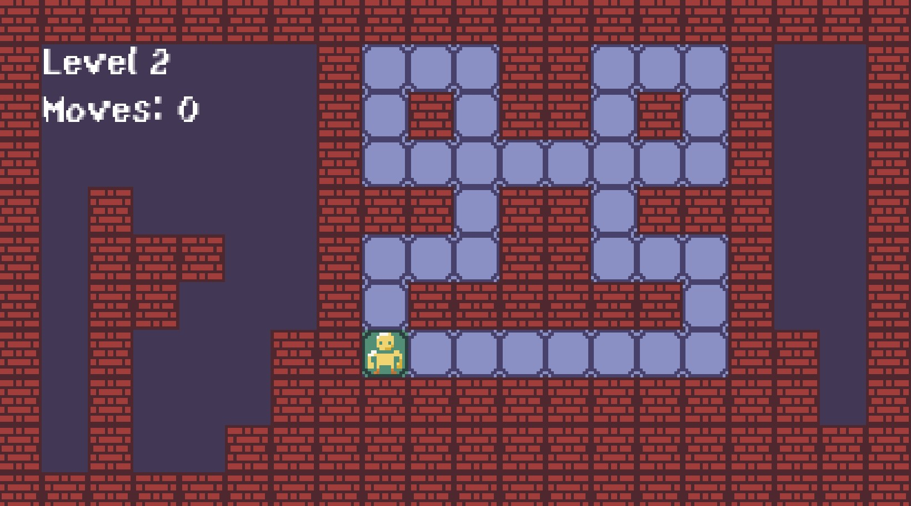
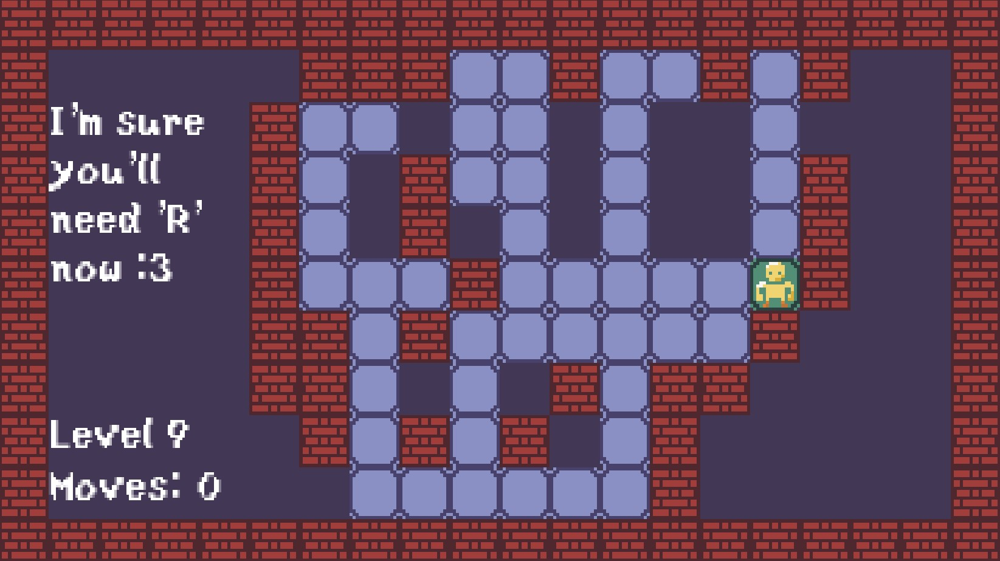

# My TileMap Game [(Only 1% can get to Level 10!!)](https://legoguy32109.itch.io/only-1-can-make-it-to-level-10) Documentation

Final Project for 2D game development from Andy Harris *(Inspired by mobile game ads)*
* * *

## User Instructions

To play my game, just click the **[bold link here](https://legoguy32109.itch.io/only-1-can-make-it-to-level-10)** or up in the title to reach the itch.io page. You can run it in your browser and you move the player with WASD or the arrow keys ➡⬅⬆⬇.

## Game Design Document

## Software Engineering Plan

## State Transition Diagram
